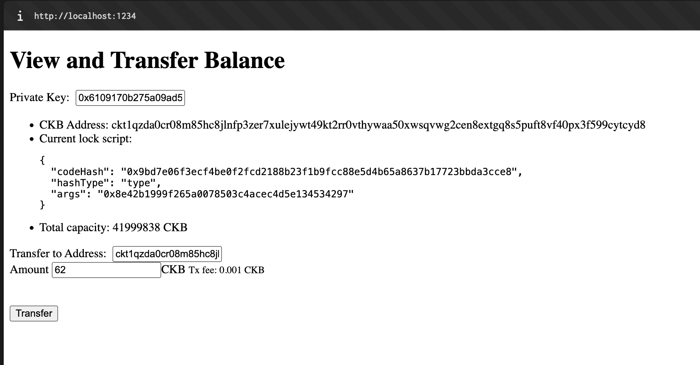
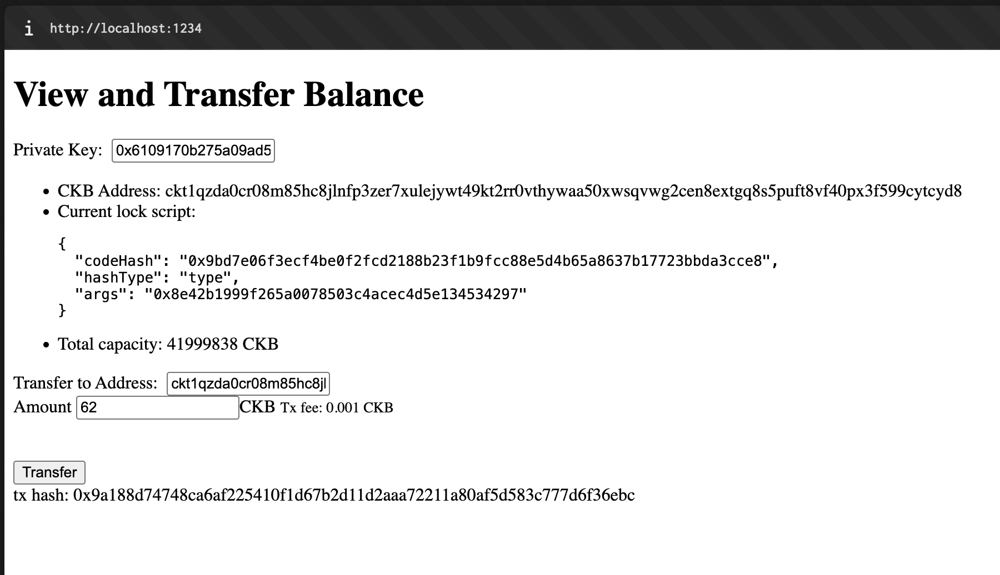
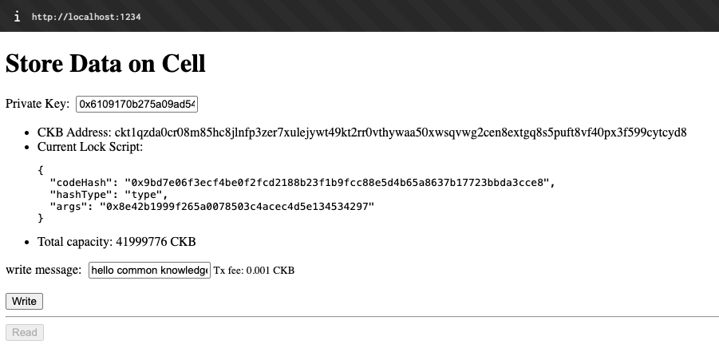
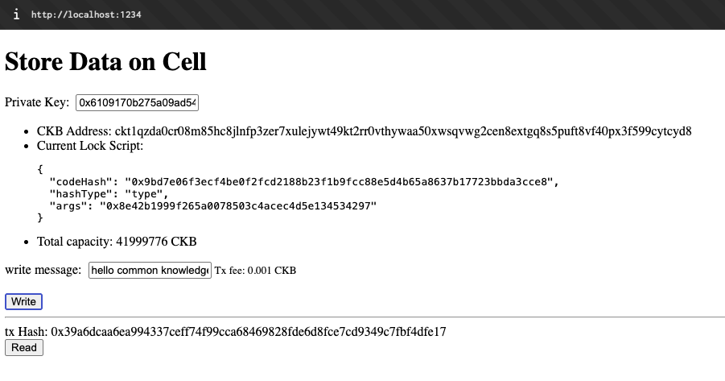
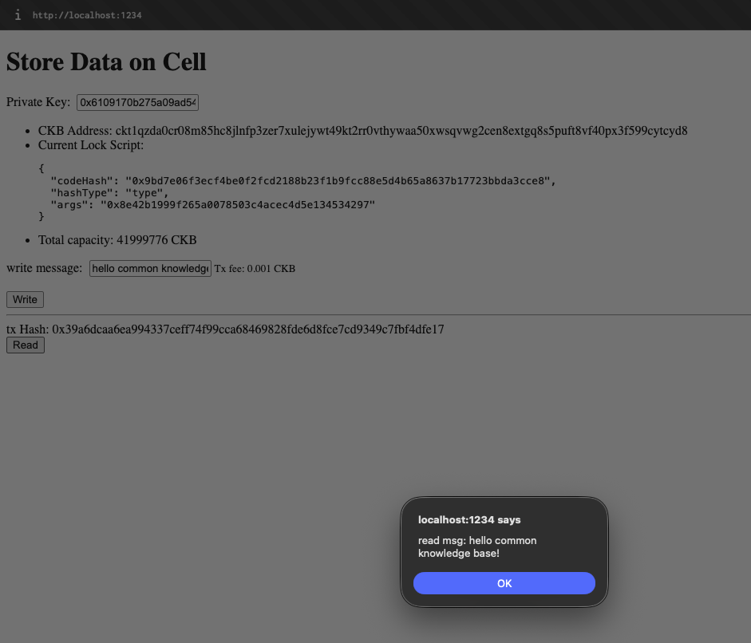

# Week 2 Report

**Week ending:** Aug 19, 2026

This week I moved from theory into the beginner exercises, covering Transfer CKB and Store Data on a Cell.

## What I learned

Both exercises use the official example dApps from the Nervos docs repo instead of building anything from scratch — clone the repo, point the app at devnet with `NETWORK=devnet npm start`, and it spins up a small local web app at `localhost:1234`. Each page shows your private key, derived CKB address, current lock script, and total capacity, plus a form specific to the exercise.

For Transfer CKB, I didn't touch any of the fields — just filled in the amount and destination address that were already there and hit Transfer. It worked first try: 62 CKB sent, tx fee 0.001 CKB, and the page printed back the tx hash once it went through. Seeing the lock script and address derived directly from the private key on screen made the cell/lock model from the Academy lessons feel more concrete — it's the same `codeHash`/`hashType`/`args` structure, just rendered in a UI instead of raw JSON this time.

Store Data on a Cell was the same pattern with a "write message" field instead: typed in a message ("hello common knowledge base!"), hit Write, and got a tx hash back. Then hit Read and it pulled the message straight back from the cell. That was the clearest illustration yet of what a cell actually is — it's not just capacity/CKB sitting there, it can carry arbitrary data, and reading it back is just querying the cell's data field rather than a database.

## Challenges

None this time — both example dApps handled everything, so it was mostly about getting devnet running and pointing each app at it.

## Screenshots

| | |
|---|---|
|  | The Transfer dApp at `localhost:1234`, showing address, lock script, and capacity on devnet. |
|  | Transfer confirmed — tx hash returned after clicking Transfer. |
|  | The Store Data on Cell dApp, before writing anything. |
|  | Message written to a cell — tx hash returned. |
|  | Reading the cell back — same message returned. |
