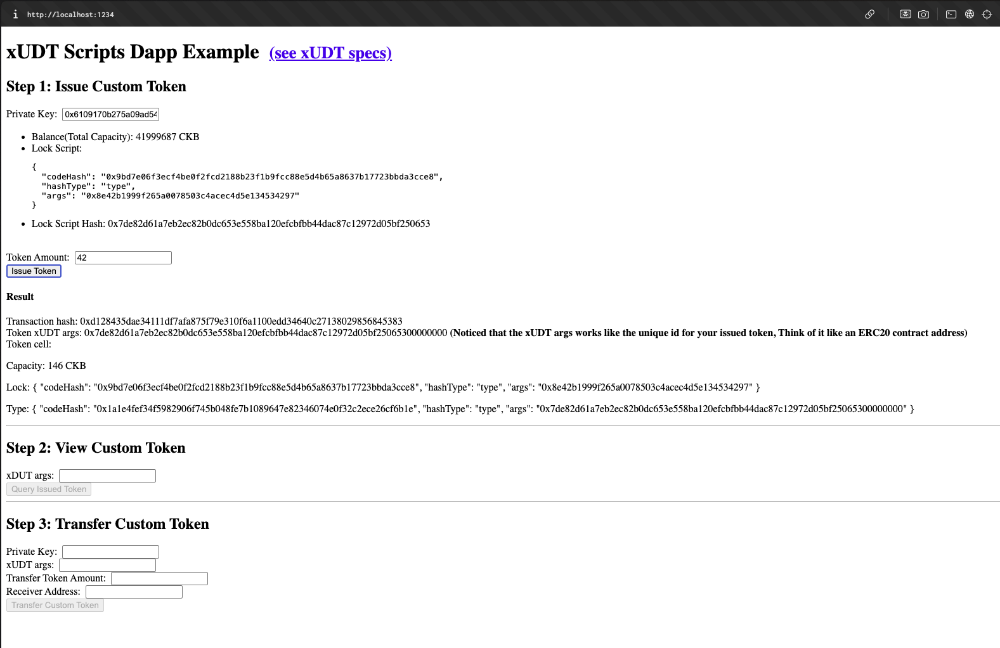
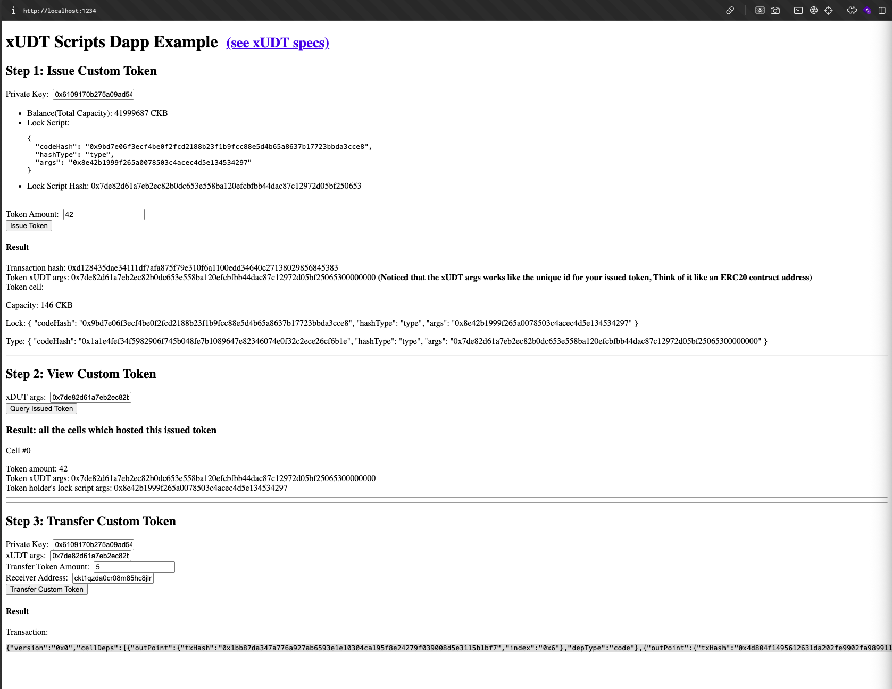
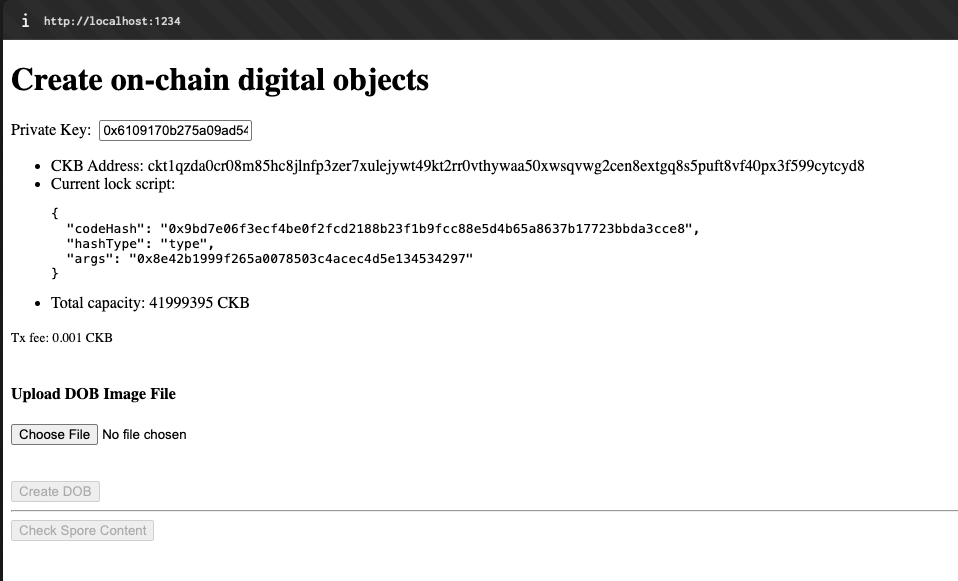
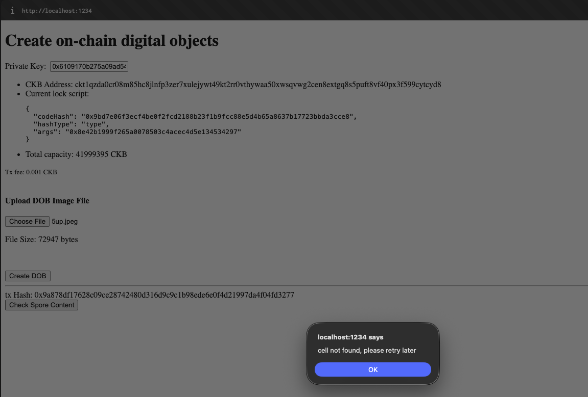
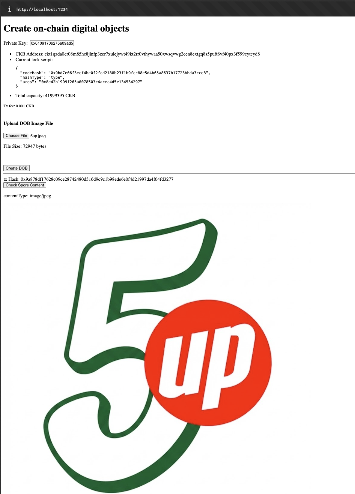

# Week 3 Report

**Week ending:** Aug 26, 2026

This week I started on the more involved beginner exercises: Create a Fungible Token and Create a DOB.

## What I learned

Same pattern as the previous two exercises — clone the official example dApp, run it against devnet, and it comes up as a local page at `localhost:1234`. This one covers issuing a custom token using xUDT (extensible UDT), which is CKB's version of an ERC20-style fungible token, but built very differently since there's no account/contract storage — it's all cells.

The page walks through three steps. First, Issue Token: I typed in an amount (42) and hit Issue — it created a cell whose Type Script is the xUDT script, with the args set to my lock script hash. That args value is basically the token's unique ID, same idea as a contract address on Ethereum, except here it's derived from who issued it rather than a deployed address. Second, View Custom Token: pasting that same xUDT args back in and querying showed the cell holding my 42 tokens, confirming the balance lives in the cell's data field, not in the "contract." Third, Transfer Custom Token: sent 5 of the 42 tokens to myself, and the resulting transaction included both the transferred amount and the leftover amount as separate output cells, each still carrying the same xUDT type script.

What clicked for me here is that a "token balance" in CKB isn't a stored account number, it's however many cells you happen to hold matching a given lock + type script. Transferring is really the same destroy-old-cell/create-new-cell pattern from Lesson 1, just applied to a Type Script instead of a plain CKB transfer.

Then I moved on to Create a DOB, which uses the Spore Protocol to turn a file into an on-chain digital object. Same setup pattern again (clone, `NETWORK=devnet npm start`), but this time the form takes an image upload instead of a number. I picked a random jpeg, hit Create DOB, and it minted a Spore Cell holding the image's content-type and raw bytes directly in the cell's data field — no external storage or IPFS link, the image itself lives on-chain. Hitting "Check Spore Content" afterward re-fetched the cell and rendered the image straight from what was stored, which was a good way to see that spore cells really do hold arbitrary content, not just a pointer to it.

## Challenges

Create DOB itself had no issues, but clicking "Check Spore Content" right after minting threw `cell not found, please retry later`. The mint transaction hadn't been confirmed/indexed on devnet yet, so the query for the cell came back empty. Waiting a few seconds and retrying with the same tx hash fixed it — a timing issue, not a real bug.

## Screenshots

| | |
|---|---|
|  | Step 1 — Issue Token, 42 tokens issued with tx hash. |
|  | Steps 2 & 3 — querying the issued token, then transferring 5 tokens to my own address. |
|  | Create a DOB — upload form, before minting. |
|  | The "cell not found" error from checking spore content too soon after minting. |
|  | Retried after a few seconds — spore content resolved, image rendered straight from the cell. |

## Next steps

Continuing the beginner track with Build a Simple Lock.
