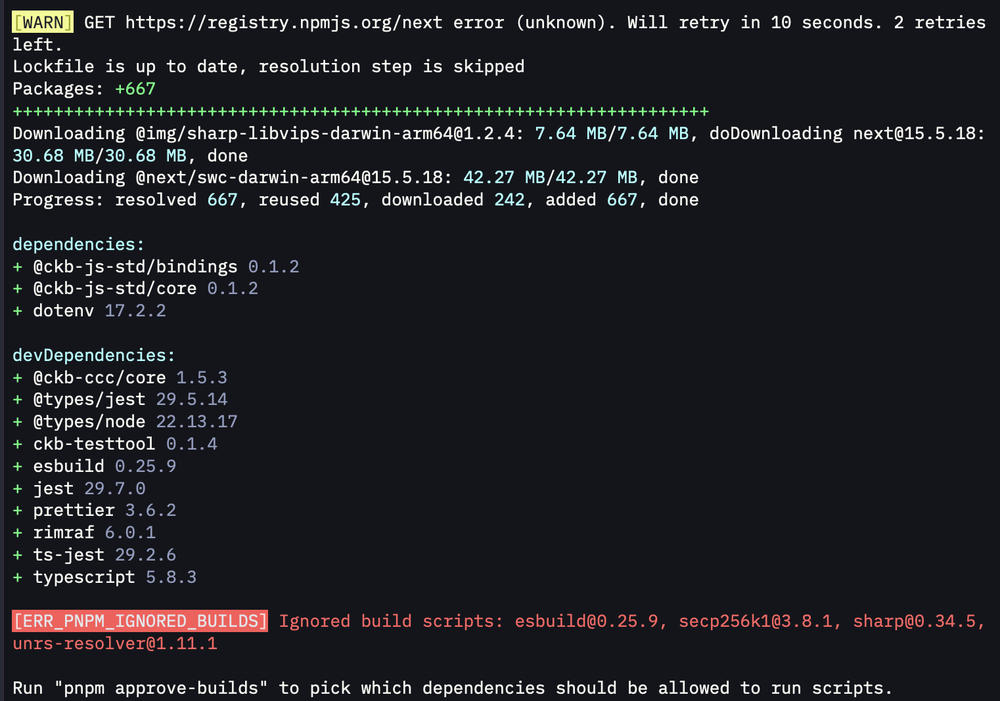
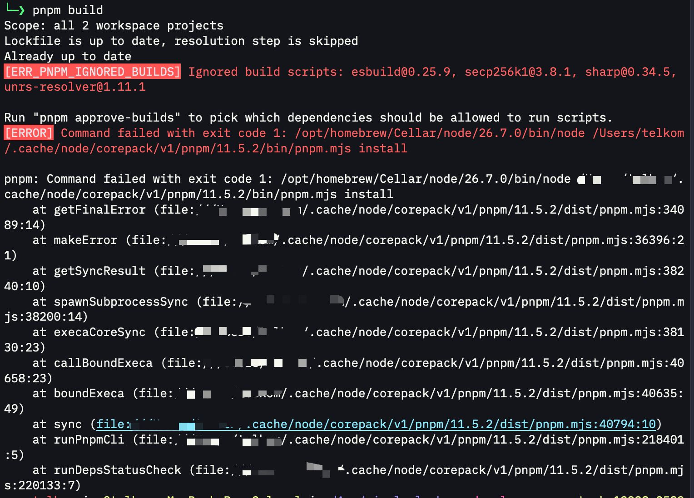
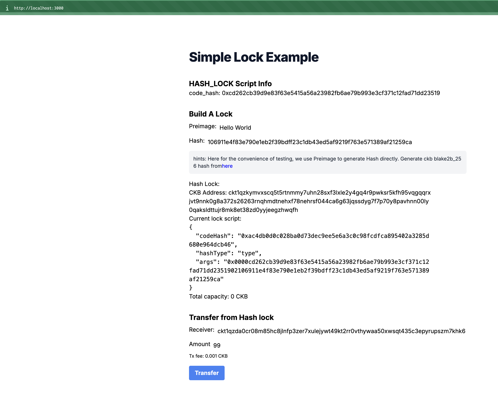
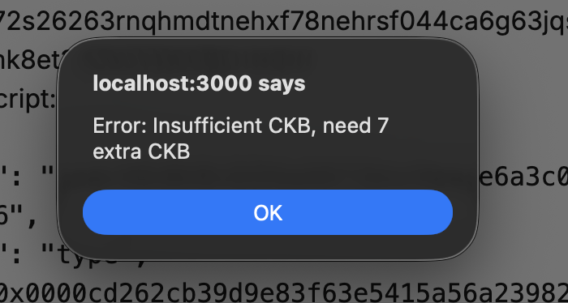
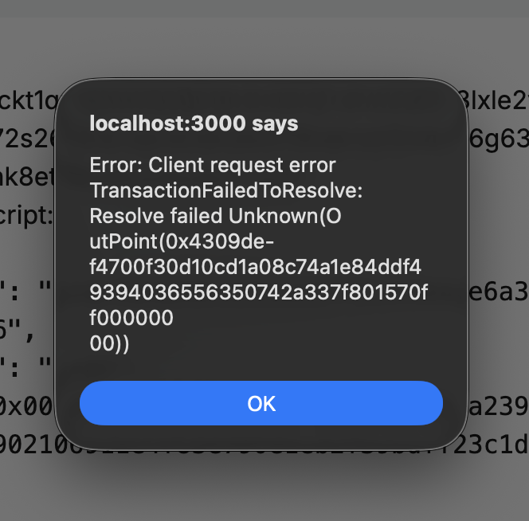
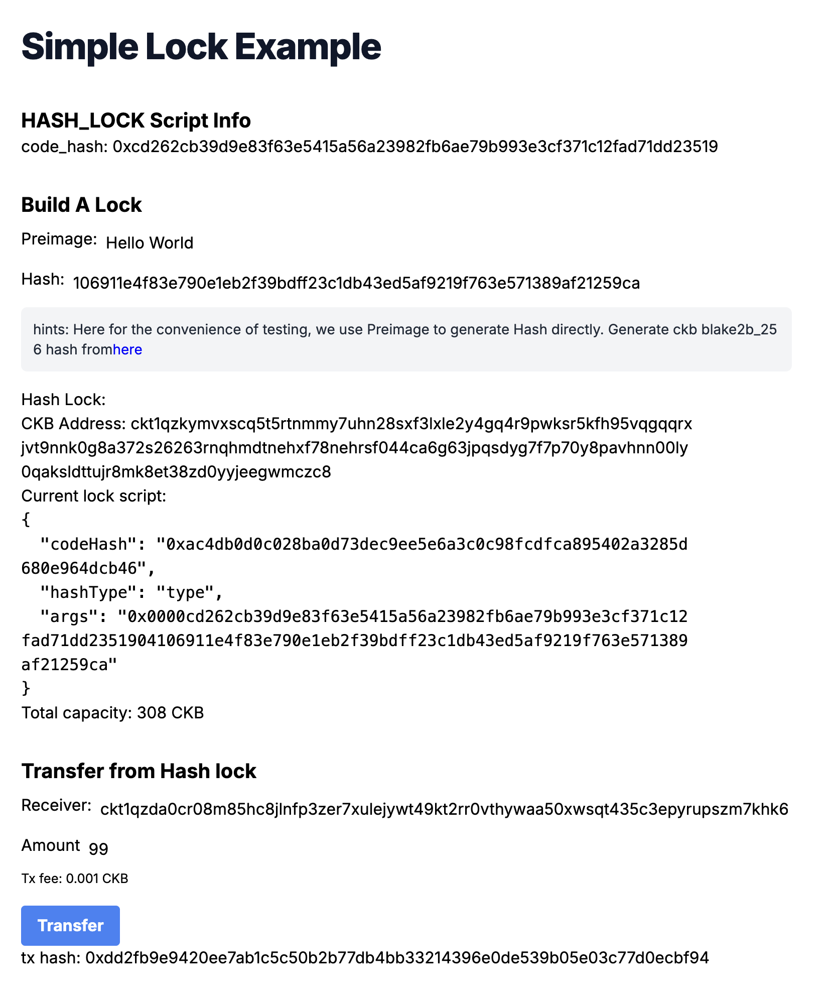

# Week 4 Report

**Week ending:** Sep 2, 2026

This week I finished the beginner exercises with Build a Simple Lock — by far the most involved one so far, and the one that finally forced me to touch actual deployment/config plumbing instead of just clicking buttons in a pre-wired example.

## What I learned

This exercise is different from the previous ones: instead of a plain `npm install && npm start`, it's a two-part project (a `hash-lock` contract plus a Next.js frontend) that uses `pnpm`, and you have to build and deploy the contract yourself before the frontend even works.

The core idea is a "hash lock" — instead of unlocking a cell with a signature like the standard SECP256K1 lock, this custom lock checks that whoever's spending the cell knows a secret preimage whose hash matches what's baked into the lock's args. The frontend lets you type a preimage (I used "Hello World"), hashes it, and derives a CKB address from that hash plus the deployed contract's code hash. Send CKB to that address, and the only way to spend it is by supplying the correct preimage again. It's a nice minimal example of what a Lock Script is for at its core — an arbitrary condition for authorizing a spend, not necessarily "prove you own this key."

Funding that hash-lock address turned into its own lesson: `offckb transfer` couldn't parse the address at all, so I ended up writing a tiny one-off script in the `nckb` contracts project reusing the same CCC client/signer helper from earlier exercises, which parses arbitrary lock scripts more generically than the CLI does.

## Challenges

This one had more friction than everything else combined so far:

- **`pnpm install` blocked build scripts.** pnpm ignores postinstall/build scripts for some deps (esbuild, secp256k1, sharp) by default. Fixed with `pnpm approve-builds`, approving all of them, then reinstalling.
- **`pnpm build` failed right after**, tripping over the same ignored-builds issue before the approval had fully taken effect — resolved itself once the approve step above was redone properly.
- **First Transfer attempt: "Insufficient CKB, need 7 extra CKB."** The 200 CKB I sent to the hash-lock address wasn't quite enough to cover the 99 CKB transfer plus fee plus the minimum capacity for the change cell. Topped up with a bit more.
- **Second Transfer attempt: `TransactionFailedToVerify` / `Resolve failed Unknown(OutPoint(...))`.** This turned out to be a stale contract deployment reference — redeploying the contract (`pnpm run deploy -- --network devnet`) generated a new OutPoint in the root `deployment/scripts.json`, but the copy under `frontend/deployment/scripts.json` hadn't been synced and still pointed at the old, now-invalid OutPoint. Had to manually copy the updated file over and restart the frontend dev server (a browser refresh alone wasn't enough).
- **That fix also changed the derived address** — the redeploy corrected the lock's `hashType` from `data1` to `data2`, which changed the lock args and therefore the CKB address. Had to fund the new address instead of the old one.
- **`offckb transfer` couldn't parse the hash-lock address** ("Unknown address format"), even when copy-pasted correctly. Worked around it with a small CCC-based script instead, which handles arbitrary lock scripts rather than only well-known ones.
- Along the way I also had one genuine transcription bug on my end (not the tools') — a long CKB address got mis-copied by one character, which is exactly the kind of thing that silently breaks bech32m addresses. Lesson: always copy addresses directly, never retype them.

Eventually the third attempt went through: 99 CKB transferred out of the hash-locked cell using preimage "Hello World", tx hash `0xdd2fb9e9420ee7ab1c5c50b2b77db4bb33214396e0de539b05e03c77d0ecbf94`.

## Screenshots

| | |
|---|---|
|  | `pnpm install` ignoring build scripts for esbuild/secp256k1/sharp. |
|  | `pnpm build` failing before the build-script approval had taken effect. |
|  | The Simple Lock dApp at `localhost:3000` — preimage, derived hash, and hash-lock address. |
|  | First transfer attempt — insufficient capacity. |
|  | Second attempt — failed on a stale contract OutPoint after redeploy. |
|  | Third attempt — success, 99 CKB unlocked and transferred with the correct preimage. |

## Next steps

Beginner track is done. Moving on to the Script development course (Intermediate track).
