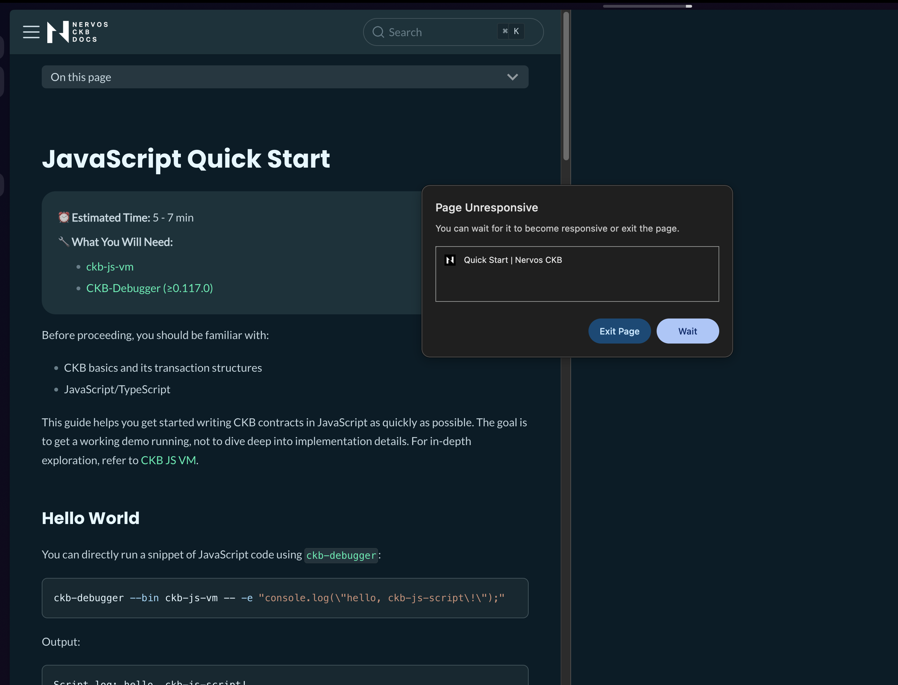

# Week 5 Report

**Week ending:** Sep 09, 2026

With the beginner exercises done, this week was reading instead of hands-on — going through the Script development material to understand what's actually running under the hood, and thinking about which language track to commit to going forward.

## What I learned

The handbook points to a "Script development course" with 10 numbered lessons, but that page doesn't exist anymore — the docs got reorganized under `docs/script/js/*` and `docs/script/rust/*` instead. Since `nckb` is currently JS/TS, I read through the JS track first: Quick Start, how `ckb-js-vm` works, the `ckb-js-std` API split (`bindings` vs `core`), syscalls, and how tests are written with `ckb-testtool` + `ckb-debugger`.

After going through that, I looked into switching to Rust for actual contract work going forward — partly because the handbook recommends it for anything more serious, and partly because it fits better with what I actually want to focus on (security). In the process I got a little sidetracked: I found `ckb-sdk-rust` on GitHub and assumed that was the thing I needed, before realizing it's actually the *client-side* Rust SDK (building transactions/RPC calls from an app), not the on-chain contract toolkit. The one I actually want is `ckb-std`, which is what on-chain Lock/Type Scripts written in Rust use, compiled directly to RISC-V instead of running through an interpreter like `ckb-js-vm` does for JS.

## Challenges

- Conflated the client SDK (`ckb-sdk-rust`, analogous to `@ckb-ccc/core` which I already use in `nckb`) with the on-chain contract SDK (`ckb-std`, analogous to `@ckb-js-std`). Good to sort that out now before writing any actual Rust contract code.
- The docs.nervos.org page itself gave me trouble — the JS Quick Start page made the browser tab hang badly enough that Chrome showed a "Page Unresponsive" dialog, and my laptop struggled enough that I had to close and reopen the browser to recover. Not sure if it's a heavy syntax-highlighter on that page or something else, but worth flagging as feedback on the docs site.

## Screenshots

| | |
|---|---|
|  | docs.nervos.org's JS Quick Start page triggering a "Page Unresponsive" browser dialog. |

## Next steps

Set up a Rust contract project alongside the existing JS `hello-world` one in `nckb` (using `ckb-std`, not `ckb-sdk-rust`), and start on the Rust version of the Script quick start.
