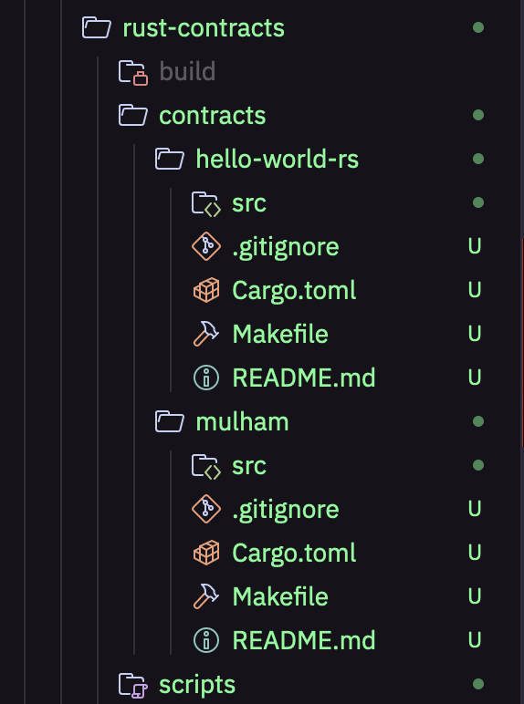
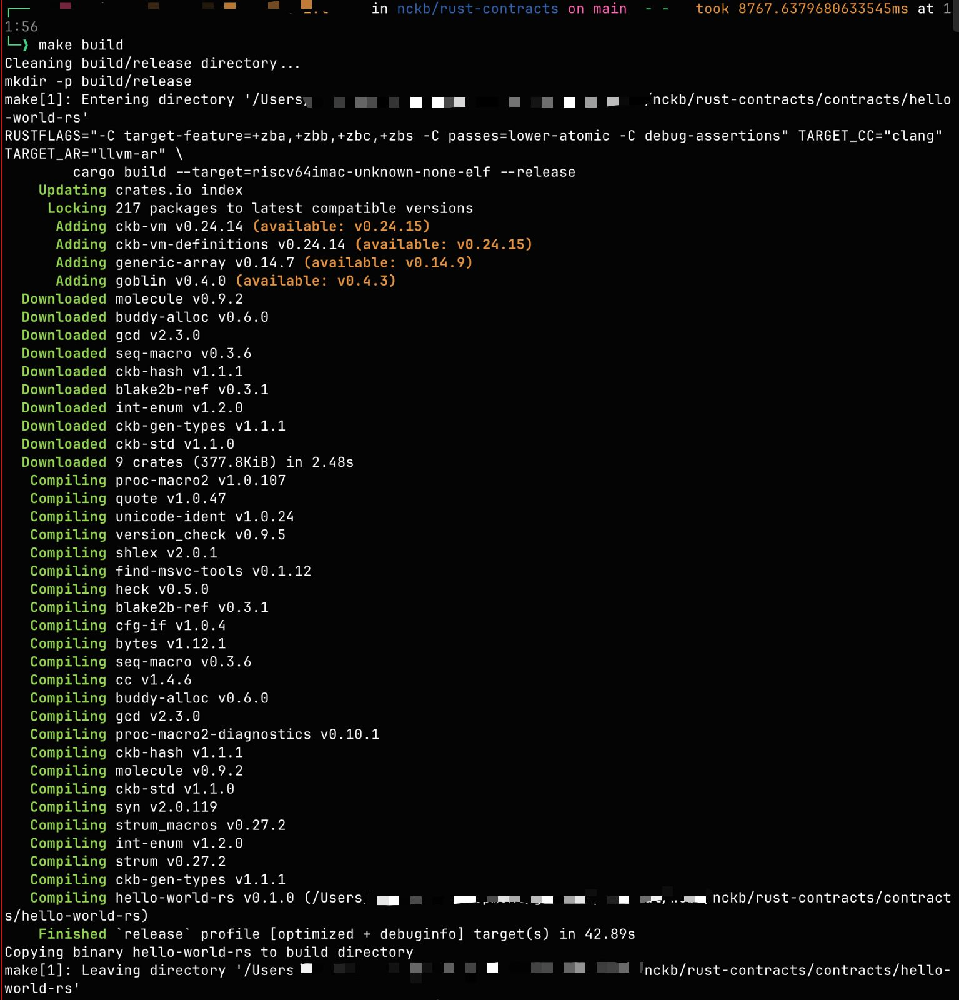
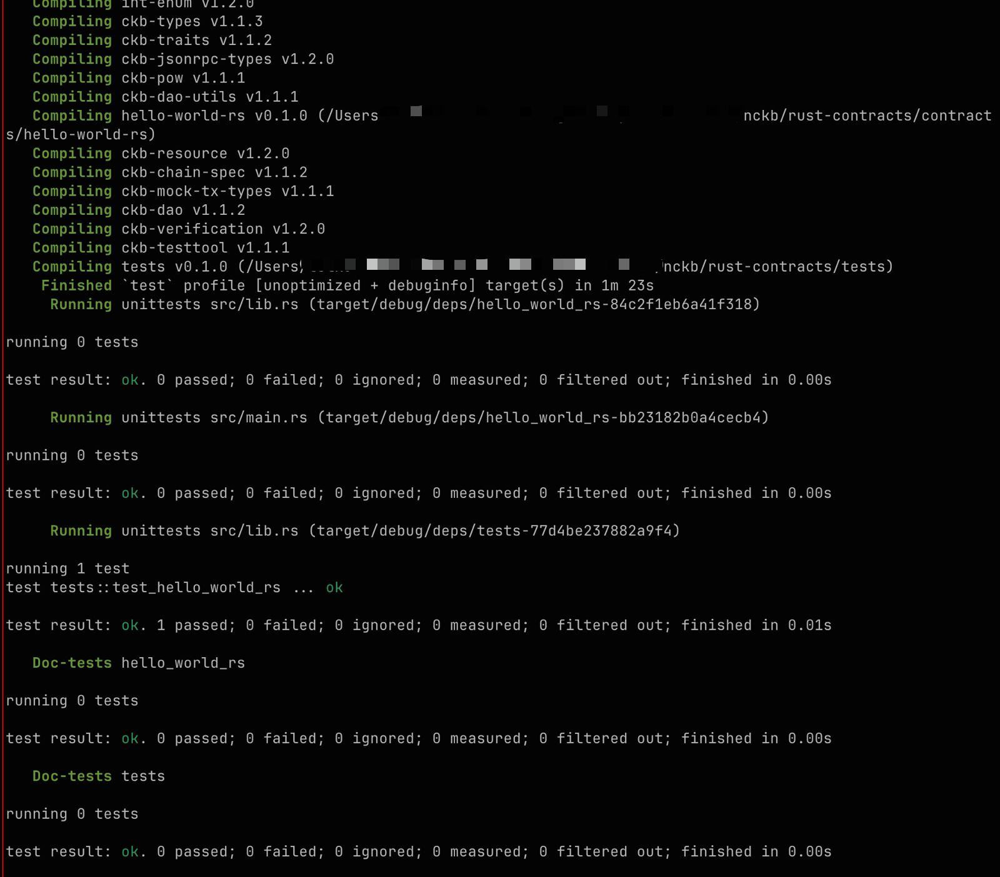
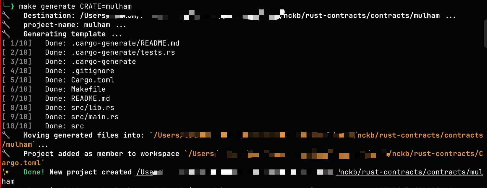
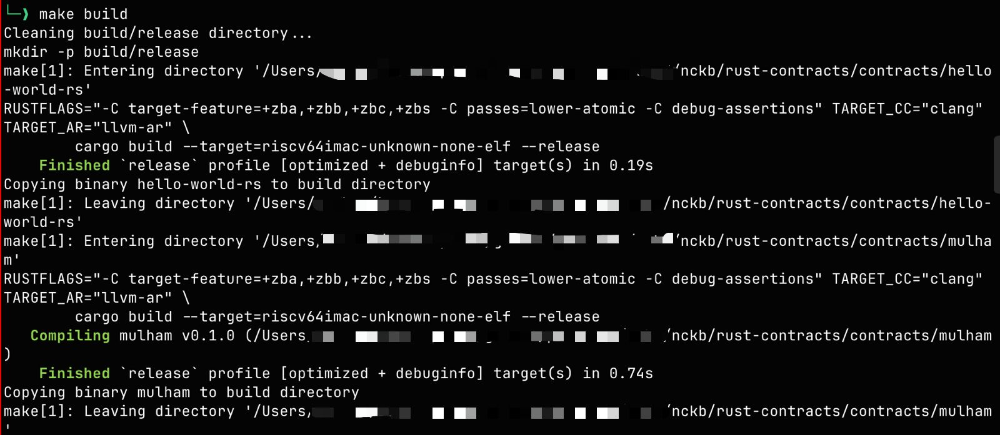
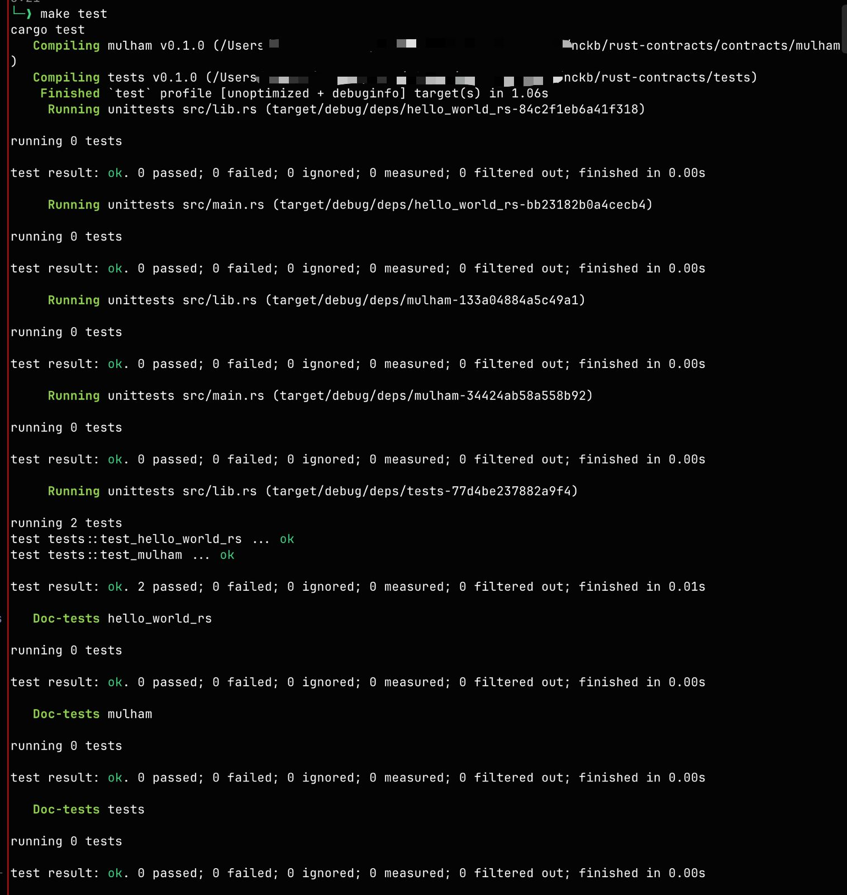

# Week 6 Report

**Week ending:** Sep 16, 2026

Last week ended with a plan to move from JS to Rust for contract work. This week I actually did it — set up a Rust contract workspace with `ckb-std`, got the default contract building and passing tests, then wrote a second contract that reads its own script args.

## What I learned

The biggest shift in how I think about CKB contracts: **a Script doesn't store state — it just returns 0 or non-zero.** That's the whole job. `program_entry()` returns an `i8`, and `0` means "this transaction is valid, let it through" while anything else rejects it. Coming from thinking of smart contracts as things that hold and mutate data, this reframes it completely — the contract is a validator sitting in front of a transaction, not a place where data lives.

The other thing that caught me off guard was how much of the workflow is already wired up in the `Makefile` that `ckb-script-templates` generates. I expected to be hand-rolling `cargo build --target=riscv64imac-unknown-none-elf` with the right `RUSTFLAGS` and `TARGET_CC`, but `make build` already does all of it. `make generate CRATE=<name>` is even better — it scaffolds the crate, registers it as a workspace member in `Cargo.toml`, *and* adds a matching test function in `tests/src/tests.rs`, all in one command. Honestly a relief; it made the whole thing much easier to get moving on than I expected.

Concretely, what I built:

- `rust-contracts/` — a workspace generated with `cargo generate gh:cryptape/ckb-script-templates workspace`
- `contracts/hello-world-rs` — the default contract, just to confirm the toolchain works end to end
- `contracts/mulham` — my own contract, which calls `ckb_std::high_level::load_script()`, pulls out `script.args()`, and prints the length and bytes via `ckb_std::debug!`. Returns `0` on success, `-1` if loading the script fails.

Both compile to RISC-V and both pass under `ckb-testtool` (`2 passed; 0 failed`). Code is at https://github.com/mulhamna/nckb under `rust-contracts/`.

## Challenges

- **macOS ships tools too old for this toolchain.** The quick start asks for Make ≥4.3, Bash ≥5.0, GNU Sed ≥4.7, and Clang ≥18. My machine had Make 3.81 and Bash 3.2 out of the box, and BSD sed instead of GNU sed. Fixed with `brew install make gnu-sed bash`, but Homebrew installs these under `g`-prefixed names by default, so I also had to prepend the `libexec/gnubin` directories to `PATH` in `~/.zshrc` to make plain `make` and `sed` resolve to the GNU versions.
- **Apple's clang can't target RISC-V at all.** This one wasn't obvious — `clang --version` reported version 21, which is well past the ≥18 requirement, so it looked fine. But `clang --print-targets` on Apple's build lists zero RISC-V entries. I needed Homebrew's `llvm@21`, whose clang does list `riscv32`/`riscv64`. Version number alone isn't enough to tell whether a compiler will work here.
- **A passing test hides the contract's output.** `make test` showed `test_mulham ... ok` but none of my `ckb_std::debug!` lines. They're captured by `cargo test` unless the test fails. Running `cargo test -- --nocapture` surfaces them — worth knowing before spending time wondering whether the debug calls ran at all.

## Screenshots

| | |
|---|---|
|  | The generated workspace — `contracts/hello-world-rs` and `contracts/mulham` side by side. |
|  | First `make build`: `cargo build --target=riscv64imac-unknown-none-elf --release`, finished in 42.89s. |
|  | First `make test` — `test_hello_world_rs ... ok`. |
|  | `make generate CRATE=mulham` scaffolding the second contract and adding it to the workspace. |
|  | Building both contracts after adding the `load_script` logic. |
|  | `2 passed; 0 failed` — both `test_hello_world_rs` and `test_mulham`. |

## Next steps

Pass real args into the test so `mulham` prints something other than `Args Len: 0`, and re-run with `--nocapture` to actually see it. After that, move on to a lock script — a contract that returns `0` only when the args match what's in the witness — since that's the closest thing to the security angle I want to focus on, and I've already seen the finished JS version of it back in week 4.
