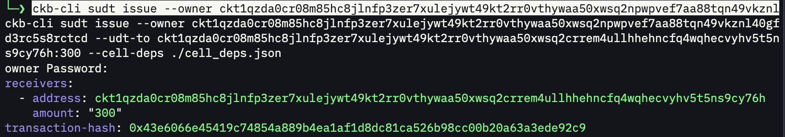
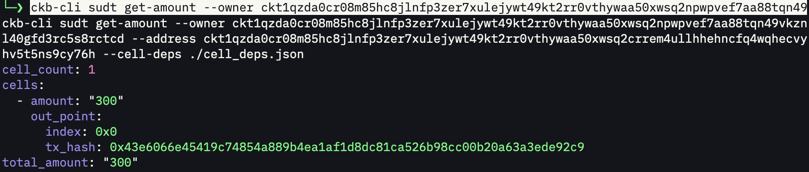
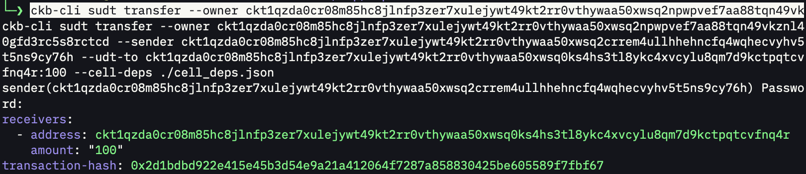

# Week 7 Report

**Week ending:** Sep 23, 2026

This week was two-part: first verifying the Rust `args` output from last week's `mulham` contract, then moving on to the sUDT (Simple UDT) standard — reading the spec and actually issuing/transferring a token with `ckb-cli` on testnet.

## What I learned

**Rust args, confirmed.** Ran `cargo test -- --nocapture` on `rust-contracts` and finally saw the debug output that was hidden last week: `Args Len: 1` and `Args Data: [2a]` (0x2a = 42, the value I passed into the test). Both `test_hello_world_rs` and `test_mulham` still pass. Closes out the loose end from last week's report.

**sUDT structure.** A SUDT cell is: `data` = a 128-bit little-endian `amount`, `type` = the sudt script with `args` set to the hash of an *owner lock*, `lock` = whatever the current holder uses. The owner lock is what gates minting — a transaction can only issue new SUDT if one of its inputs is unlocked by that owner lock. Coming from xUDT (which I already used in Week 3), this clicked fast: xUDT is basically sUDT plus an extension mechanism for custom rules. I'd already been using sUDT's core idea without realizing it.

**Installing `ckb-cli` was its own lesson.** `cargo install ckb-cli` failed outright — the release depends on `ckb-build-info = "=0.105.1"`, which has been **yanked** from crates.io, so cargo can't resolve it at all. Had to fall back to `cargo install --git https://github.com/nervosnetwork/ckb-cli.git ckb-cli`, which built fine from source (~2m22s) at v2.0.0. Combined with there being no crates.io release that actually installs, no Homebrew tap, and no Scoop bucket, I ended up filing a GitHub issue on the repo about improving the installation/distribution story: https://github.com/nervosnetwork/ckb-cli/issues/685 — proposed proper crates.io publishing (via OIDC trusted publishing so no long-lived token is needed), a Homebrew tap, a Scoop bucket, and an install script, and offered to send a PR if a maintainer sets up the OIDC/token side.

**Testnet vs local node.** `ckb-cli` defaults to `127.0.0.1:8114`, which errors out unless you explicitly point it at testnet with `--url https://testnet.ckb.dev` (or `export API_URL=...`). Easy to miss since local devnet has been the default all along in previous weeks.

**The official sUDT CLI tutorial is stale.** The wiki's "Prepare the tutorial" section wants you to build `simple_udt`/`anyone_can_pay`/`ckb-cheque-script` from source via Docker, checking out old commits, then deploy them yourself using a *fork of ckb-cli on an unmerged PR branch* just to get the `code_hash`/`tx_hash` values for `cell_deps.json`. Rather than doing that, I pulled the current testnet `sudt` and `anyone_can_pay` script info straight from `offckb`'s own tracked `system-scripts.json` (which is actively maintained), and built `cell_deps.json` from that instead — skipped `cheque` entirely since it wasn't in there and wasn't needed for the basic issue/transfer flow.

**`--to-acp-address` isn't for plain addresses.** First `sudt issue` attempt with `--to-acp-address` failed because the destination has to already be an anyone-can-pay-formatted address (different lock script), not a normal account address. Dropped the flag and issued straight to a normal address instead — simpler, and enough to prove the mechanism works.

## Challenges

- `cargo install ckb-cli` failed due to a yanked dependency version — worked around with `cargo install --git`.
- Filed [nervosnetwork/ckb-cli#685](https://github.com/nervosnetwork/ckb-cli/issues/685) about the installation/distribution gaps this surfaced.
- `ckb-cli` pointed at the wrong network (local node) by default — needed `--url https://testnet.ckb.dev`.
- The official sUDT tutorial's setup steps (build-from-source + unmerged ckb-cli fork) were impractical to follow as written; used `offckb`'s tracked testnet script info instead.
- `--to-acp-address` requires actual ACP-formatted addresses, not plain ones — dropped it for a simpler issue/transfer.
- Multi-line heredoc pastes into the terminal rendered visibly garbled (duplicated/interleaved lines) — the file still wrote correctly underneath, but it was alarming until verified with `python3 -m json.tool`.

## Screenshots

| | |
|---|---|
|  | `cargo test -- --nocapture` showing `Args Len: 1` / `Args Data: [2a]` for `mulham`. |
|  | `cargo install ckb-cli` failing on a yanked dependency, then succeeding via `cargo install --git`. |
|  | `ckb-cli sudt issue` — 300 SUDT issued from owner to account1, tx hash `0x43e6066e...`. |
|  | `ckb-cli sudt get-amount` confirming account1's balance: `total_amount: "300"`. |
|  | `ckb-cli sudt transfer` — 100 SUDT sent from account1 to account2, tx hash `0x2d1bdbd9...`. |

## Next steps

Move on to Nervos DAO next — deposit/withdraw mechanics and how compensation from secondary issuance works.
