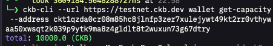
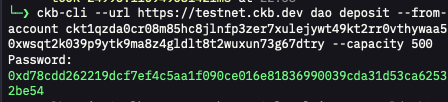
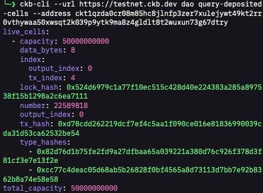
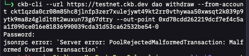

# Week 8 Report

**Week ending:** Sep 30, 2026

This week's main topic was Nervos DAO — deposit/withdraw mechanics and the secondary-issuance compensation model. Got further into `ckb-cli` packaging problems than into the DAO itself, honestly. Second half of the week I went back to Spore Protocol, since I only ever used it hands-on (minting the DOB in Week 3) without really getting why it works the way it does.

## What I learned

**Nervos DAO isn't staking in the usual sense** — it's a mechanism to counter the dilution from CKB's secondary issuance. Deposit CKB into a DAO cell (type script = the Nervos DAO script, data = 8 zero bytes), and you get a proportional share of each epoch's secondary issuance for as long as it stays deposited. The compensation is calculated from the ratio of `AR` (accumulated rate, a value baked into every block header) at deposit time vs. withdraw time — `AR_withdraw / AR_deposit` applied to the deposited capacity.

**Withdrawal is two phases, not one.** Phase 1 ("request withdrawal") can happen any time — it creates a `withdrawing cell` referencing the original deposit block via `header_deps`. Phase 2 (actually unlocking the funds + compensation) can only happen after a minimum lock period (~180 epochs, i.e. days, enforced via the `since` field) — so a full deposit→withdraw cycle can't be demonstrated in a single week regardless of anything else. That's a real constraint of the system, not something I ran out of time for.

**Lost my testnet accounts from Week 7.** `CKB_CLI_HOME` was pointed at `/tmp/tmp-ckb-cli-home`, and `/tmp` on macOS gets cleared (reboot or periodic cleanup), so the keystore was empty this week. Moved to `~/.ckb-cli-home` (persisted, added to `~/.zshrc`) so this doesn't happen again.

**Found two more distribution problems with `ckb-cli`, on top of last week's.** Deposit worked fine, but `ckb-cli dao withdraw` (phase 1) failed with `PoolRejectedMalformedTransaction: Malformed Overflow transaction` — using the git-HEAD build from last week (`cargo install --git ... ckb-cli`, no tag pinned). Tried fixing it by installing the actual `v2.0.0` tag instead, on the theory that HEAD might have a regression — but the tagged release doesn't even *compile* against a current Rust toolchain (ambiguous `Into::into()` calls in `molecule.rs`/`rpc/types.rs`, looks like dependency drift since `ckb_jsonrpc_types` now has conflicting `From` impls). Added both findings as a follow-up comment on the GitHub issue I filed last week: https://github.com/nervosnetwork/ckb-cli/issues/685#issuecomment-5915523699 — reinforces the original ask (a proper crates.io release built against a pinned lockfile would avoid both problems).

**Went back to Spore Protocol after week 3.** When I minted that DOB earlier it basically just worked without me understanding why, so this time I actually read through the spec. Biggest thing that stuck: a Spore isn't just a picture with a token wrapped around it, the value is literally tied to the CKB locked in the cell, and you can melt it back into plain CKB whenever you want — so unlike a normal NFT, burning it isn't just throwing it away. There's also this zero-fee transfer trick where creating a Spore sets aside like 1 CKB just to cover future transfer fees, so whoever you send it to doesn't need their own CKB to move it around, which is a nicer UX than I expected. The part I completely missed in week 3 is Clusters — the Spore data actually has a cluster_id field I never noticed, and that's basically how you group a bunch of Spores into one collection instead of each one floating on its own. And then there's DOB/0 and DOB/1, which I think of as the "rules" for how anything reading a Spore is supposed to interpret it — DOB/0 is more about parsing the raw data (DNA/pattern/decoder), DOB/1 is specifically about turning that into an actual on-chain SVG image. Kind of makes sense now why the DOB I minted just rendered back correctly when I checked the content, it wasn't magic, it's following that standard.

## Challenges

- Lost testnet accounts because `/tmp` isn't persistent on macOS — moved `CKB_CLI_HOME` somewhere durable.
- `ckb-cli` default RPC target is local devnet (`127.0.0.1:8114`); needed `--url https://testnet.ckb.dev` again (global flag has to go before the subcommand, not after — tripped on that too).
- The `dao` subcommand name I guessed (`query-nervos-dao-cells`) doesn't exist — actual name is `query-deposited-cells`.
- Transcribed a tx hash wrong reading it off a screenshot (again — same class of mistake as Week 7's sUDT address). Fixed once the user pasted the raw CLI output as text instead.
- `dao withdraw` (phase 1) fails with a "Malformed Overflow transaction" server error on the git-HEAD `ckb-cli` build.
- Installing the `v2.0.0` tag to work around that doesn't compile at all on current Rust — a second, separate packaging problem, now also reported upstream.

## Screenshots

| | |
|---|---|
|  | Testnet balance confirmed after faucet claim — `total: 10000.0 (CKB)`. |
|  | `ckb-cli dao deposit` — 500 CKB deposited, tx hash returned. |
|  | `ckb-cli dao query-deposited-cells` confirming the deposit cell on-chain. |
|  | `dao withdraw` (phase 1) failing with `Malformed Overflow transaction`. |
|  | `cargo install --git ... --tag v2.0.0` failing to compile on current Rust. |

## Next steps

Circle back to DAO phase-1 withdraw once there's a working `ckb-cli` (or try building the withdraw transaction manually instead of relying on the CLI, the way I built transfers by hand back in CKB Academy Lesson 2). Also want to actually try a Cluster hands-on at some point instead of just reading about it, since that's the one piece of Spore I still haven't touched.
