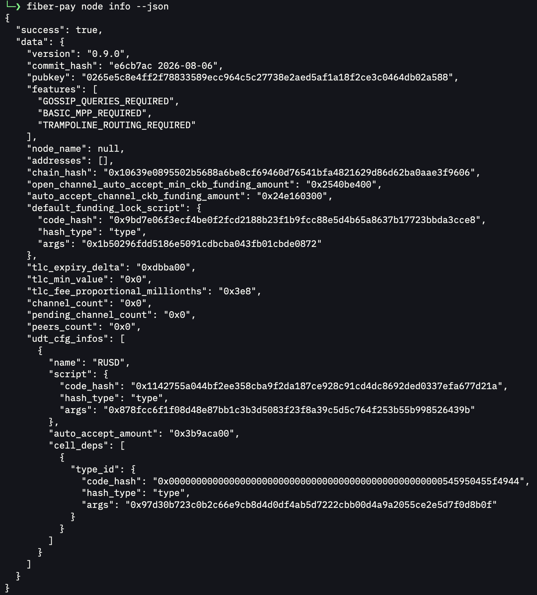
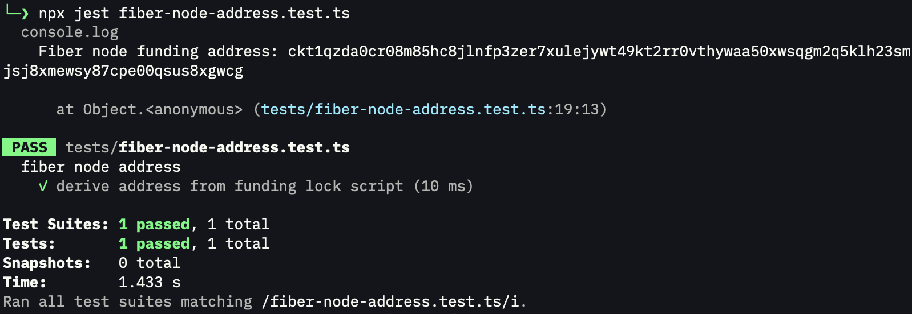
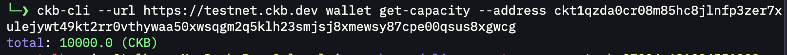

# Week 9 Report

**Week ending:** Oct 08, 2026

Last of the reading-list items before capstone: SSRI and RGB++. Ended up spending most of the week actually getting `fiber-pay` running end to end instead, which turned into its own thing worth writing up.

## What I learned

SSRI is basically giving a Script a second mode to run in: instead of only validating on-chain and returning pass/fail, it can also run off-chain and hand back real data/logic through a defined interface (`get_methods`/`has_methods`). That clicked for me as "a Script that's also an API" — apps don't have to reverse-engineer a script's data layout anymore, they can just ask it.

RGB++ is the one that took longest to actually get. The core trick is isomorphic binding: every Bitcoin UTXO gets mapped 1-to-1 to a CKB Cell, ownership stays on Bitcoin (its lock script decides who can spend), but the actual state and logic live on CKB where it's Turing-complete. A Bitcoin tx carries an OP_RETURN commitment that has to match a parallel CKB tx, so the two move together — spend the Bitcoin UTXO and the CKB side updates with it. The analogy that made it stick: the Bitcoin UTXO is the physical object, the CKB Cell is its shadow. Bitcoin gets smart-contract behavior without anyone touching Bitcoin's consensus.

The bigger chunk of the week was `fiber-pay` (relevant to the capstone discussion with Neon from the last couple weeks). Cloned it, and installing it turned into a real debugging session:

- `pnpm install && pnpm build` failed on `better-sqlite3` — a native addon that wouldn't compile against Node v26.7.0. Turned out the V8 API it was using (`info.This()`) got removed in that Node version, and there's no prebuilt binary for it yet either. Fixed by installing `nvm`, switching to Node 22, and rebuilding from clean `node_modules`.
- `pnpm link --global` then failed with `ERR_PNPM_NO_GLOBAL_BIN_DIR` — pnpm didn't have a global bin dir configured yet. `pnpm setup` + restarting the shell fixed it.
- First `fiber-pay node start --daemon` looked like it started but immediately died — `node ready` showed `pid: null`. Checked `fiber-pay logs --source all` and found `failed to init contracts context: Cannot resolve cell dep for type id Script {...}`. Thought the testnet deployment referenced in config was stale, but querying the RPC directly for that exact type ID (`get_cells`) showed the cell does exist. Restarted the node fresh after the Node 22 fix and it came up fine — the earlier failure was from before the environment was actually sorted, not a real contract issue.
- Once the node was running (`nodeRunning: true`, `rpcReachable: true`), `node ready` said `NEED_CHANNEL` — made sense, no liquidity yet.
- Derived the node's own funding address from `default_funding_lock_script` in `node info --json` (same codeHash as the regular SECP256K1 sighash lock, so I could just build the address with `ccc.Address.fromScript` the same way I've done addresses all program), funded it via the testnet faucet, confirmed balance with `ckb-cli`.
- `peer list` showed the node had already auto-connected to 4 peers via the bootnode config, so I skipped `peer connect` and went straight to `channel open --peer <bootnode> --funding 200`. Got a `temporaryChannelId` back, then `channel watch --until CHANNEL_READY` actually hit `CHANNEL_READY` within about a minute.

End state: a real, working Fiber Network payment channel against testnet, opened from a from-source build I debugged myself. `channel list` shows it with 101 CKB local balance, state `CHANNEL_READY`.

## Challenges

- `better-sqlite3` native build incompatible with Node v26 (removed V8 API) — fixed with nvm + Node 22.
- `pnpm link --global` failed on missing global bin dir — fixed with `pnpm setup`.
- First node startup died with a cell-dep resolution error that looked like a real contract/config problem but turned out to be a leftover from the broken-Node-version state, not reproducible after the environment fix.
- Had to work out the funding address and peer connection flow myself since the quickstart doc doesn't spell out "how do I fund my own node's wallet" — traced it through `node info --json`'s `default_funding_lock_script` field instead.

## Screenshots

| | |
|---|---|
|  | `better-sqlite3` native build failure on Node v26, before switching to Node 22. |
|  | `fiber-pay node info --json` — node running on testnet, funding lock script, UDT config. |
|  | Deriving the node's funding address from its lock script via a small `ccc` script. |
|  | Balance confirmed after funding the node's address from the testnet faucet. |
|  | Peer list, `channel open`, and `channel watch` reaching `CHANNEL_READY`. |

## Next steps

Try sending an actual invoice/payment through the open channel. Then get back to the capstone direction with Neon — the `khie-mobile` + Fiber gap is still the leading idea, and now I've got hands-on experience with the exact toolchain (`fiber-pay`) that would sit underneath it.
